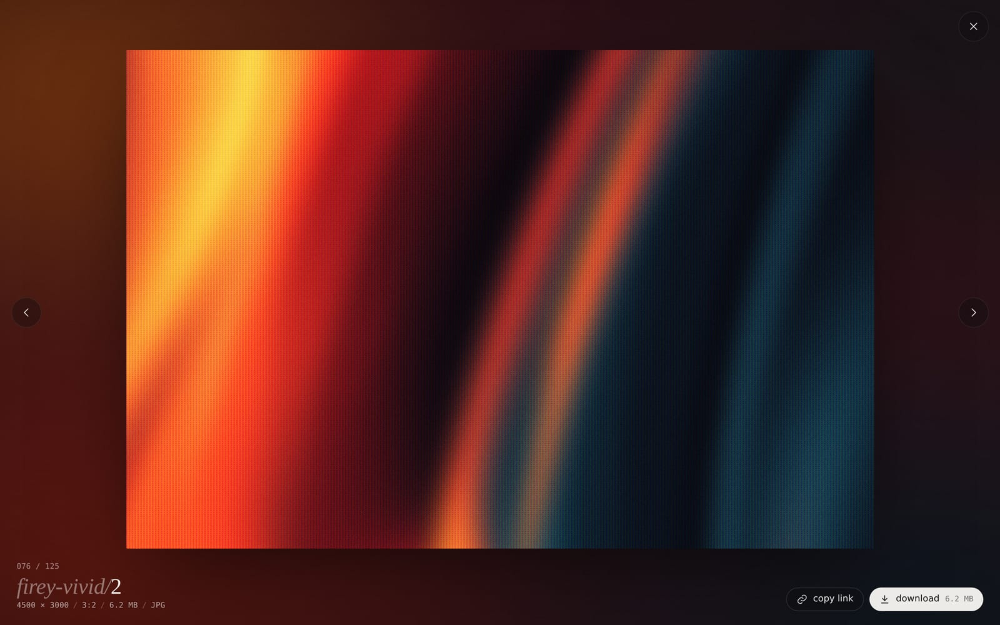

# egor's wallpapers

A quiet, dark gallery for my wallpaper collection. Browse, preview, and download the originals at full resolution.

**→ [wp.egorz.com](https://wp.egorz.com)**




## Features

- Masonry gallery with categories, a color filter and random / newest / oldest / popular sorting
- Viewer with zoom down to the original pixels, swipe and keyboard navigation
- Favorites saved in your browser, one-click original downloads, a share link for every wallpaper

## How it works

The wallpapers live in [`wallpapers/`](wallpapers), one folder per category. On every push, a small Node build script uses [sharp](https://sharp.pixelplumbing.com) to generate thumbnails, previews, color tags and link-preview images, and writes a static site to `dist/`. Images that haven't changed are reused from the previous deploy, so a new upload only processes what's new. Cloudflare Workers serves the result.

No framework, just plain HTML, CSS and JavaScript.

```sh
npm install
npm run dev   # build and preview at http://localhost:8788
```
